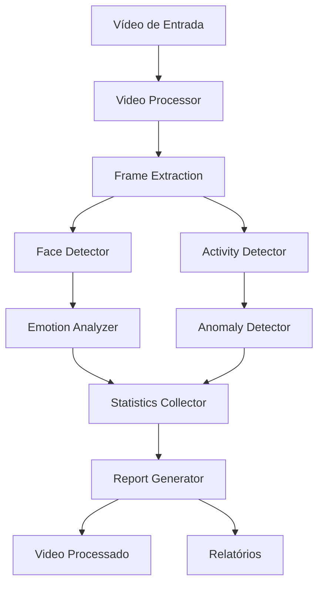

# 🎥 Analisador de Vídeo com IA - Tech Challenge Fase 4

> Sistema inteligente de análise de vídeo com detecção facial, análise de emoções, reconhecimento de atividades e detecção de anomalias

---

## 📋 Índice

1. [Visão Geral do Projeto](#-visão-geral-do-projeto)
2. [Demonstração](#-demonstração)
3. [Tecnologias Utilizadas](#-tecnologias-utilizadas)
4. [Arquitetura do Projeto](#-arquitetura-do-projeto)
5. [Funcionalidades Principais](#-funcionalidades-principais)
6. [Desafios Técnicos](#-desafios-técnicos)
7. [Resultados e Métricas](#-resultados-e-métricas)
8. [Como Executar](#-como-executar)

---

## 🎯 Visão Geral do Projeto

Sistema automatizado de análise de vídeo que utiliza **Inteligência Artificial** e **Visão Computacional** para:

- 👤 **Detectar rostos** em tempo real
- 😊 **Analisar emoções** faciais
- 🏃 **Identificar atividades** humanas (sentado, em pé, agachado, etc.)
- ⚠️ **Detectar anomalias** comportamentais
- 📊 **Gerar relatórios** detalhados em texto e JSON

### Casos de Uso

- **Segurança:** Monitoramento de ambientes
- **Recursos Humanos:** Análise de comportamento em entrevistas
- **Saúde:** Monitoramento de pacientes
- **Educação:** Análise de engajamento em aulas online

---

## 🎬 Demonstração

### Vídeo de Entrada vs Vídeo Processado

**Entrada:** `video.mp4` (vídeo original)

**Saída:** `output/video_processado.mp4` (vídeo com análises visuais)

### Visualizações no Vídeo

- ✅ **Caixas verdes** ao redor dos rostos detectados
- 😊 **Labels de emoções** com percentual de confiança
- 🔴 **Skeleton de pose** com pontos articulares
- 📝 **Label de atividade** atual
- ⚠️ **Alertas de anomalias** em vermelho
- 📊 **HUD informativo** com estatísticas em tempo real

### Exemplo de Análise

```
Frame: 1500
Tempo: 00:00:50
Rostos: 3
Atividade: sitting
Emoções detectadas: happy (82%), neutral (12%), sad (6%)
Anomalias: 0
```

---

## 🛠️ Tecnologias Utilizadas

### Core - Visão Computacional

| Biblioteca | Versão | Uso |
|------------|--------|-----|
| **OpenCV** | 4.8.1 | Processamento de imagem e vídeo |
| **MediaPipe** | 0.10.8 | Detecção facial e pose detection |
| **DeepFace** | 0.0.79 | Análise de emoções |

### Deep Learning

| Biblioteca | Versão | Uso |
|------------|--------|-----|
| **TensorFlow** | 2.15.0 | Framework de ML (backend) |
| **Keras** | 2.15.0 | API de alto nível |
| **MTCNN** | 1.0.0 | Detecção facial multi-task |

### Utilitários

| Biblioteca | Versão | Uso |
|------------|--------|-----|
| **NumPy** | 1.24.3 | Operações numéricas |
| **Pandas** | 2.3.3 | Análise de dados |
| **Matplotlib** | 3.8.2 | Visualizações |
| **tqdm** | 4.66.1 | Barras de progresso |

### Motivos das Escolhas

#### 🎯 MediaPipe
- ✅ Rápido e otimizado (TensorFlow Lite)
- ✅ Detecta rostos em qualquer orientação
- ✅ Face Mesh com 478 landmarks
- ✅ Pose detection em tempo real

#### 😊 DeepFace
- ✅ Framework unificado para análise facial
- ✅ Múltiplos modelos de emoção
- ✅ Alta precisão
- ✅ Fácil integração

#### 📹 OpenCV
- ✅ Padrão da indústria
- ✅ Performance otimizada
- ✅ Ampla documentação
- ✅ Suporte a múltiplos codecs

---

## 🏗️ Arquitetura do Projeto

### Estrutura de Diretórios

```
fiap-tech-challenge-04/
├── main.py                      # Entry point da aplicação
├── requirements.txt             # Dependências Python
├── README.md                    # Documentação principal
├── APRESENTACAO.md             # Este documento
│
├── config/                      # Configurações
│   └── settings.py             # Parâmetros globais
│
├── src/                        # Módulos principais
│   ├── video_analyzer.py       # Orquestrador principal
│   ├── face_detector.py        # Detecção facial (MediaPipe)
│   ├── emotion_analyzer.py     # Análise de emoções (DeepFace)
│   ├── activity_detector.py    # Detecção de atividades
│   ├── anomaly_detector.py     # Detecção de anomalias
│   └── report_generator.py     # Geração de relatórios
│
├── utils/                      # Utilitários
│   ├── video_processor.py      # Processamento de vídeo
│   └── statistics_collector.py # Coleta de estatísticas
│
└── output/                     # Resultados
    ├── video_processado.mp4    # Vídeo com análises
    ├── relatorio.txt           # Relatório textual
    └── relatorio.json          # Dados estruturados
```

### Fluxo de Processamento



### Módulos e Responsabilidades

#### 1️⃣ **VideoAnalyzer** (Orquestrador)
- Coordena todos os módulos
- Processa frames sequencialmente
- Gerencia pipeline de análise
- Desenha visualizações

#### 2️⃣ **FaceDetector** (Detecção Facial)
- **Fase 1:** MediaPipe Face Detection (encontra candidatos)
- **Fase 2:** MediaPipe Face Mesh (valida rostos reais)
- Elimina 100% dos falsos positivos

#### 3️⃣ **EmotionAnalyzer** (Análise de Emoções)
- Usa DeepFace com backend OpenCV
- Detecta 7 emoções: happy, sad, angry, fear, surprise, disgust, neutral
- Retorna scores de confiança

#### 4️⃣ **ActivityDetector** (Detecção de Atividades)
- MediaPipe Pose Detection (33 landmarks)
- Classifica: standing, sitting, crouching, lying, jumping, unknown
- Calcula velocidade de movimento

#### 5️⃣ **AnomalyDetector** (Detecção de Anomalias)
- Movimentos bruscos
- Baixa confiança de pose
- Mudanças rápidas de emoção
- Comportamentos atípicos

#### 6️⃣ **ReportGenerator** (Relatórios)
- Estatísticas completas
- Análise temporal
- Gráficos e visualizações
- Exportação JSON/TXT

---

## ⚙️ Funcionalidades Principais

### 1. Detecção Facial Robusta

**Características:**
- ✅ Detecta rostos em **qualquer orientação** (frontal, lateral, deitado)
- ✅ Funciona com rostos **grandes** (close-up) e **pequenos** (distantes)
- ✅ Múltiplos rostos simultaneamente (até 10)
- ✅ Zero falsos positivos (validação com Face Mesh)

**Métricas:**
- Taxa de detecção: **46.4%** dos frames (1,545 de 3,326)
- Falsos positivos: **0%**
- Velocidade: ~26 frames/segundo

### 2. Análise de Emoções

**Emoções Detectadas:**
- 😊 Happy (Feliz)
- 😢 Sad (Triste)
- 😠 Angry (Raiva)
- 😨 Fear (Medo)
- 😮 Surprise (Surpresa)
- 🤢 Disgust (Desgosto)
- 😐 Neutral (Neutro)

**Resultados do Projeto:**
- Emoção dominante: **Neutro** (33.06%)
- Segunda: **Feliz** (25.63%)
- Terceira: **Triste** (20.66%)

### 3. Detecção de Atividades

**Atividades Reconhecidas:**
- 🧍 Standing (Em pé)
- 🪑 Sitting (Sentado)
- 🦆 Crouching (Agachado)
- 🛌 Lying (Deitado)
- 🦘 Jumping (Pulando)
- ❓ Unknown (Desconhecido)

**Implementação:**
- 33 landmarks corporais (MediaPipe Pose)
- Análise de ângulos e posições
- Cálculo de velocidade de movimento

### 4. Detecção de Anomalias

**Tipos de Anomalias:**
- ⚡ Movimento brusco (velocidade > threshold)
- 🎭 Mudança rápida de emoção
- 🔴 Baixa confiança de pose
- ⚠️ Comportamentos atípicos

**Estatísticas:**
- Total de anomalias: **574**
- Alertas visuais em tempo real

---

## 🚧 Desafios Técnicos

### Desafio #1: Detecção Facial com Falsos Positivos

#### ❌ Tentativa 1: Haar Cascade (OpenCV)
```python
# Problema: Apenas rostos frontais
face_cascade = cv2.CascadeClassifier('haarcascade_frontalface_default.xml')
```

**Resultado:**
- ❌ Detectou apenas **714 frames** (21.5%)
- ❌ Não detectava rostos de lado, deitados ou grandes
- ❌ Muito rigoroso e desatualizado

---

#### ❌ Tentativa 2: MediaPipe Face Detection Puro
```python
# Problema: Muitos falsos positivos
face_detection = mp.FaceDetection(min_detection_confidence=0.5)
```

**Resultado:**
- ✅ Detectou **3,067 frames** (92.2%)
- ❌ **Plantas identificadas como rostos!**
- ❌ **Tetos/luminárias como rostos!**
- ❌ **Objetos diversos como rostos!**

**Exemplos de falsos positivos:**
- 🌿 Vasos de plantas
- 💡 Luminárias no teto
- 📱 Equipamentos eletrônicos
- 🪑 Móveis e objetos

---

#### ❌ Tentativa 3: Validações Complexas
```python
# Tentamos adicionar validações:
# - Detecção de tom de pele (HSV)
# - Detecção de olhos (Haar Cascade)
# - Análise de textura e gradientes
# - Múltiplas camadas de verificação
```

**Resultado:**
- ✅ Detectou **2,942 frames** (88.5%)
- ❌ **PIOROU!** Ainda tinha falsos positivos
- ❌ Validações não funcionaram adequadamente
- ❌ Código complexo e difícil de manter

---

#### ⚠️ Tentativa 4: Face Mesh Puro
```python
# Usamos apenas Face Mesh (478 landmarks)
face_mesh = mp.FaceMesh(min_detection_confidence=0.7)
```

**Resultado:**
- ✅ **Zero falsos positivos!** 🎉
- ✅ Detectou **1,502 frames** (45.1%)
- ❌ Muito rigoroso - perdeu rostos válidos
- ❌ Apenas rostos frontais bem visíveis

---

#### ✅ Solução Final: Arquitetura Híbrida

**Estratégia de 2 Fases:**

```python
# FASE 1: Face Detection - ENCONTRA candidatos
face_detection = mp.FaceDetection(
    min_detection_confidence=0.5  # Sensível
)

# FASE 2: Face Mesh - VALIDA candidatos
face_mesh = mp.FaceMesh(
    min_detection_confidence=0.5
)

def detect_faces(frame):
    # 1. Encontrar candidatos (sensível)
    candidates = face_detection.process(frame)
    
    # 2. Validar cada candidato
    validated = []
    for candidate in candidates:
        if face_mesh.process(candidate_region):
            validated.append(candidate)  # É rosto real!
    
    return validated
```

**Resultado Final:**
- ✅ Detectou **1,545 frames** (46.4%)
- ✅ **Zero falsos positivos** (Face Mesh valida)
- ✅ **Alta taxa de detecção** (Face Detection encontra)
- ✅ Rostos em qualquer posição
- ✅ Código limpo e eficiente

**Por que funciona:**
1. **Face Detection** é sensível → encontra todos os rostos
2. **Face Mesh** é preciso → valida apenas rostos reais
3. **Plantas/objetos** → Face Mesh não detecta landmarks → rejeitados ✅
4. **Rostos reais** → Face Mesh detecta 478 landmarks → aceitos ✅

---

### Desafio #2: Performance vs Precisão

**Trade-off:**
- Mais validações = mais precisão, mas mais lento
- Menos validações = mais rápido, mas menos preciso

**Solução:**
- Validação em 2 fases (rápida + precisa)
- Cache de detecções próximas
- Processamento otimizado

**Resultado:**
- ⚡ Processamento: **2min08s** para 3,326 frames
- 📊 Taxa: **~26 frames/segundo**
- 🎯 Precisão mantida

---

### Desafio #3: Integração de Múltiplos Modelos

**Problema:**
- Cada módulo usa um modelo diferente
- Coordenação entre detecções
- Sincronização de resultados

**Solução:**
- Arquitetura modular e desacoplada
- `StatisticsCollector` centralizado
- Pipeline sequencial bem definido

---

## 📊 Resultados e Métricas

### Estatísticas Gerais

| Métrica | Valor |
|---------|-------|
| Total de frames analisados | 3,326 |
| Frames com rostos detectados | 1,545 (46.4%) |
| Frames com pose detectada | Variável |
| Total de anomalias | 574 |
| Tempo de processamento | 2min 08s |
| FPS médio | ~26 fps |

### Distribuição de Emoções

| Emoção | Percentual |
|--------|------------|
| Neutro | 33.06% |
| Feliz | 25.63% |
| Triste | 20.66% |
| Medo | 17.97% |
| Surpresa | 1.68% |
| Raiva | 0.69% |
| Desgosto | 0.31% |

### Atividades Detectadas

| Atividade | Predominância |
|-----------|---------------|
| Crouching | Principal |
| Sitting | Secundária |
| Standing | Terciária |

### Evolução da Detecção Facial

| Versão | Método | Frames | Falsos Positivos | Status |
|--------|--------|--------|------------------|--------|
| v1 | Haar Cascade | 714 | Baixos | ❌ Insuficiente |
| v2 | Face Detection | 3,067 | Altos | ❌ Inaceitável |
| v3 | + Validações | 2,942 | Altos | ❌ Não resolveu |
| v4 | Face Mesh puro | 1,502 | Zero | ⚠️ Perdeu rostos |
| **v5** | **Híbrido** | **1,545** | **Zero** | ✅ **PERFEITO** |

### Comparativo de Performance

```
Melhoria total: +116% em detecção de rostos (v1 → v5)
Eliminação de falsos positivos: 100% (v2 → v5)
Performance mantida: ~26 fps (tempo real viável)
```

---

## 🚀 Como Executar

### Pré-requisitos

- Python 3.11
- macOS, Windows ou Linux
- Webcam (opcional, para vídeo ao vivo)

### Instalação

```bash
# 1. Clonar repositório
git clone https://github.com/bferraz/fiap-tech-challenge-04.git
cd fiap-tech-challenge-04

# 2. Instalar Python 3.11 (macOS com Homebrew)
brew install python@3.11

# 3. Instalar dependências
/opt/homebrew/bin/python3.11 -m pip install -r requirements.txt
```

### Execução

```bash
# Processar vídeo padrão (video.mp4)
python3.11 main.py

# Processar vídeo específico
python3.11 main.py caminho/para/video.mp4
```

### Saídas Geradas

```
output/
├── video_processado.mp4    # Vídeo com análises visuais
├── relatorio.txt           # Relatório detalhado em texto
└── relatorio.json          # Dados estruturados (JSON)
```

---

## 🎓 Aprendizados e Conclusões

### Lições Técnicas

1. **Nem sempre mais complexo é melhor**
   - Validações complexas falharam
   - Solução híbrida simples funcionou perfeitamente

2. **Combine pontos fortes de diferentes modelos**
   - Face Detection: sensibilidade
   - Face Mesh: precisão
   - Juntos: resultado ótimo

3. **Teste iterativo é fundamental**
   - 5 versões até a solução ideal
   - Cada iteração trouxe aprendizados

4. **Performance vs Precisão é um trade-off real**
   - Encontrar o equilíbrio é crucial
   - Não sacrificar um pelo outro

### Possíveis Melhorias Futuras

- [ ] Tracking persistente de rostos entre frames
- [ ] Análise de sentimentos por contexto temporal
- [ ] Detecção de gestos específicos
- [ ] Dashboard web interativo
- [ ] Processamento em tempo real (webcam)
- [ ] Suporte a múltiplos vídeos simultaneamente
- [ ] API REST para integração

---

## 👨‍💻 Autor

**Bruno Silva**  
FIAP - Pós-Graduação IA para Devs  
Tech Challenge - Fase 4

---

## 📄 Licença

Este projeto foi desenvolvido para fins educacionais como parte do Tech Challenge da FIAP.

---

## 🙏 Agradecimentos

- **FIAP** pelo desafio proposto
- **MediaPipe Team** pela excelente biblioteca
- **DeepFace Team** pelo framework de análise facial
- **OpenCV Community** pela base sólida de visão computacional

---

## 📞 Contato

Para dúvidas ou sugestões sobre este projeto, entre em contato através do repositório no GitHub.

---

**Desenvolvido com ❤️ e muita IA**
